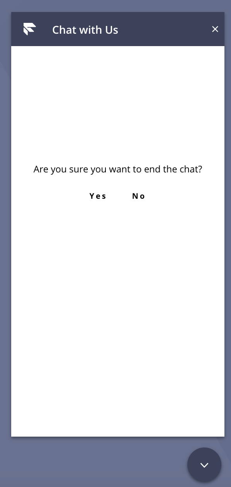

# Example webchat custom redux reducer

This project was bootstrapped with [Flex Webchat UI Sample](https://github.com/twilio/flex-webchat-ui-sample)

This package can only be consumed together with Twilio Flex. Visit http://twilio.com/flex to find out more.


## Why?
This an example of creating a custom redux reducer to the existing webchat Redux store.  

This is mainly an example - it covers the specifc case of replacing the [close chat button](https://github.com/twilio-professional-services/example-webchat-redux/blob/master/src/components/endChatModal.js) with a new component [endChatModal](https://github.com/twilio-professional-services/example-webchat-redux/blob/master/src/components/endChatModal.js). 

The component rerenders itself when it's custom action from its [reducer](https://github.com/twilio-professional-services/example-webchat-redux/blob/master/src/store/reducers/customReducer.js) is called.  The custom reducer is derived from the [state](https://github.com/twilio-professional-services/example-webchat-redux/blob/master/src/store/state.js) when initialized in App.js.

```
customState.addReducer('custom', customReducer);
manager.store.replaceReducer(customState.combinedReducers());

FlexWebChat.MessagingCanvas.Content.add(<EndChatModal key="end-chat-modal" />)

FlexWebChat.MainHeader.Content.remove('close-button');
FlexWebChat.MainHeader.Content.add(<EndChatButton key="end-chat-button" />, { sortOrder: -1, align: "end" });

this.setState({ manager })
```

The result is that a component will rerender itself and do a sample dialog of "Are you sure you want to end the chat?"   Note - the "yes" action is not implmented yet, to actually end the chat.  To do that, you might want to look at a more complete example such as [example-customer-end-chat](https://github.com/twilio-professional-services/example-customer-end-chat) .  




## Instructions

1. Install all dependencies by running:
```
npm install
```
2. Copy webchat-appConfig.sample.js in public/assets folder and configure accordingly to use your Twilio account
```
cp public/assets/webchat-appConfig.sample.js public/assets/webchat-appConfig.js
```
3. Start Flex UI by running:
```
npm start
```